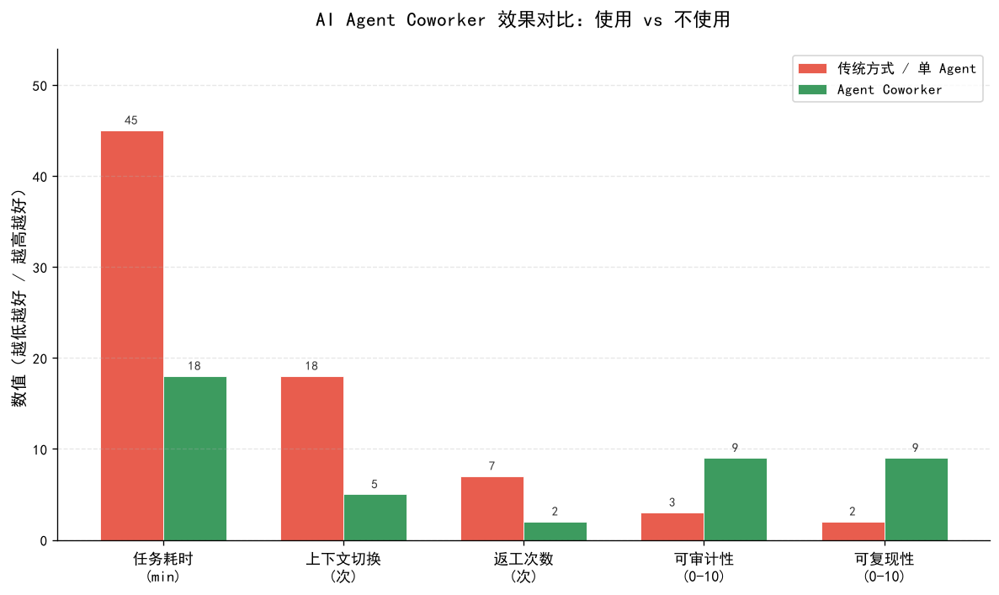
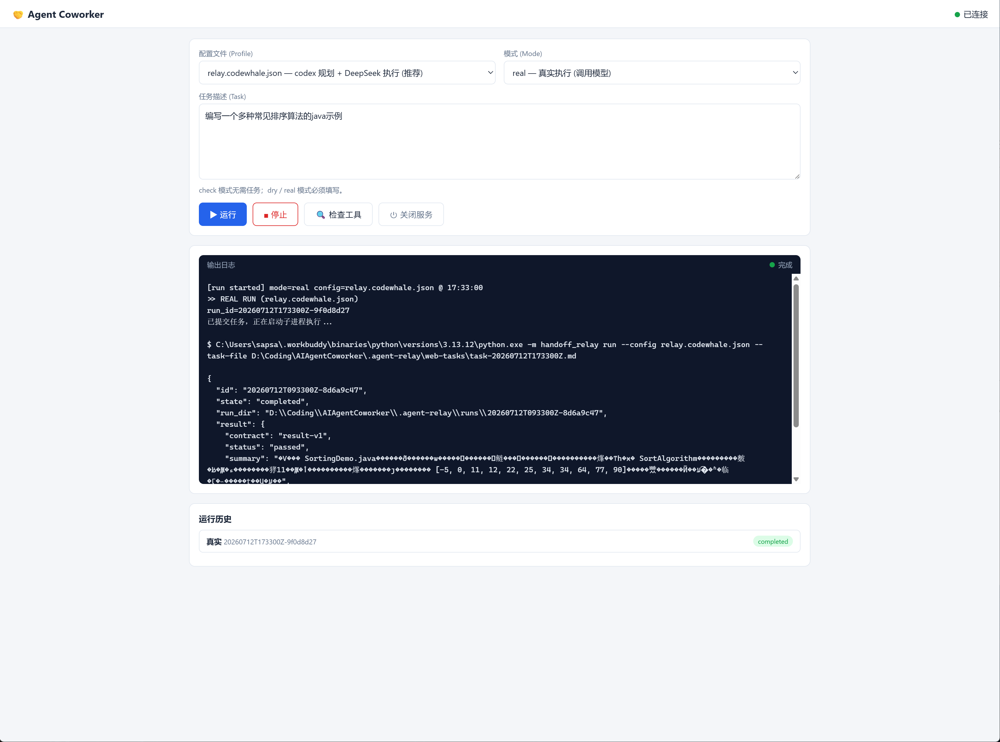

# AI Agent Coworker

> 一个本地、可审计的「指挥 Agent + 执行 Agent」双层编排器。

AI Agent Coworker（代号 `Agent Relay`）把 AI 编程任务拆成两层：

- **指挥者（Planner）**：根据任务生成结构化执行计划（plan-v1 JSON）。
- **执行者（Worker）**：读取计划，调用工具完成代码/文档交付，并返回结果（result-v1 JSON）。

两层之间通过**版本化 JSON 合同**与**事件账本**解耦，支持替换任一角色、切换不同模型，且每次运行都留下完整审计记录。

---

## 为什么要分层

| 问题 | 单 Agent 直接写代码 | Agent Coworker |
|---|---|---|
| 角色模糊 | 规划与实现混在一起 | 规划者只出计划，执行者只出交付 |
| 上下文爆炸 | 长对话里要求反复修改 | 计划一次性确定，执行按步骤走 |
| 无法审计 | 不知道模型改了什么 | plan/result 双合同 + 事件账本 |
| 工具模型绑定 | 一个 Agent 只能用一个模型 | 指挥者和执行者可分别配置 |

### 数据对比

下图是「传统方式 / 单 Agent」与「Agent Coworker」在常见指标上的示意对比：



---

## 界面一览

双击 `start-agent-coworker.bat` 后，会自动打开本地 Web 页面，在浏览器里选择配置、模式、填写任务并运行：



---

## 快速开始

### 环境要求

- Python 3.11+
- 可选 CLI：`codex`（OpenAI） / `codewhale`（DeepSeek，安装后桌面端通常自带）
- 无第三方运行时依赖，纯标准库实现

### 1. 自检

```powershell
cd D:\Coding\AIAgentCoworker
python -m handoff_relay doctor --config relay.codewhale.json
python -m unittest discover -s tests -v
```

### 2. Web 方式运行（推荐）

```powershell
# 双击 start-agent-coworker.bat
# 浏览器会自动打开 http://127.0.0.1:8000
# 在页面选择配置、模式、填写任务后点击「运行」
```

### 3. 命令行方式运行

```powershell
# 干跑：只渲染命令，不调用模型
python -m handoff_relay run --config relay.codewhale.json --task-file task.md --dry-run

# 真实运行：codex 规划 + codewhale(DeepSeek) 执行
python -m handoff_relay run --config relay.codewhale.json --task-file task.md
```

---

## 架构

```text
┌─────────────────────────────────────────────────────┐
│  用户任务（task.md）                                    │
└──────────────┬──────────────────────────────────────┘
               │
               ▼
┌──────────────────────────────────┐      ┌──────────────────────────┐
│  Planner（指挥者）                │      │  版本化 JSON 合同          │
│  codex / codewhale / mock         │─────▶│  plan-v1 / result-v1      │
└──────────────────────────────────┘      └──────────────────────────┘
               │                                      │
               │ plan.json                              │ result.json
               ▼                                      ▼
        ┌──────────────────────────────────────────────────┐
        │  Worker（执行者）                                │
        │  codewhale / codex / reasonix / mock             │
        │  实际调用工具，生成代码、文档等交付文件            │
        └──────────────────────────────────────────────────┘
               │
               ▼
        ┌──────────────────────┐
        │  outputs/<run-id>/    │
        │  任务交付物           │
        └──────────────────────┘
               │
               ▼
        ┌──────────────────────┐
        │  .agent-relay/runs/   │
        │  审计日志与事件账本     │
        └──────────────────────┘
```

### 流程说明

1. `created`：编排器创建本次运行目录（`outputs/<run-id>/` 与 `.agent-relay/runs/<run-id>/`）。
2. `planned`：Planner 输出 `plan-v1`（goal、steps、acceptance）。
3. `working`：Worker 读取计划并执行，输出 `result-v1`（status、summary、evidence）。
4. `completed` / `failed`：根据 result 状态结束运行。

每次运行都会留下：

- `task.md`：原始任务
- `plan.json`：指挥者输出
- `result.json`：执行者输出
- `events.jsonl`：事件账本
- `*.stdout.log` / `*.stderr.log`：各角色输出
- `manifest.json`：运行元数据

---

## 配置模型

配置文件（`relay.*.json`）里定义角色，并选择 `planner_role` 和 `worker_role`：

| 配置文件 | 角色组合 | 说明 |
|---|---|---|
| `relay.codewhale.json` | codex planner + codewhale worker | 推荐，codex 规划、DeepSeek 执行 |
| `relay.codewhale-only.json` | codewhale planner + codewhale worker | codex 不可用时的 fallback |
| `relay.example.json` | codex planner + reasonix worker | 参考示例，本机未安装 reasonix |
| `relay.local.json` | codex planner + codex worker | 本地旧版配置，不建议使用 |

角色 `argv` 支持占位符：

- `{workspace}`：目标项目目录
- `{prompt}` / `{prompt_file}`：给 Agent 的文本任务
- `{input_file}`：上游产生的 JSON 合同
- `{output_file}`：本角色必须写入的最终 JSON
- `{schema_file}`：本角色输出对应的 JSON Schema
- `{run_dir}`：本次审计目录
- `{outputs_dir}`：本次任务交付物目录（`outputs/<run-id>/`）

---

## 文件结构

```text
AIAgentCoworker/
├── handoff_relay/          # 核心编排器（Python 标准库）
│   ├── __main__.py         # CLI 入口
│   ├── config.py           # 配置解析
│   ├── contracts.py        # plan-v1 / result-v1 schema
│   └── runtime.py          # 运行流程与角色调用
├── tests/                  # 单元测试与 mock 夹具
├── web/                    # Web UI 静态页面
├── web_server.py           # 本地 Web 服务（HTTP + API）
├── start-agent-coworker.bat   # 一键启动脚本（Windows）
├── start-agent-coworker.ps1   # 控制台模式
├── start-web.ps1              # Web 服务模式
├── relay.codewhale.json       # 推荐配置
├── relay.codewhale-only.json  # 备选配置
├── relay.example.json         # 示例配置
├── pics/                        # README 用图片
├── outputs/                     # 任务交付物（按运行隔离）
├── .agent-relay/                # 运行审计日志（自动生成，gitignored）
└── .workbuddy/                  # 本地工作记忆（私密，gitignored）
```

---

## 测试

```powershell
python -m unittest discover -s tests -v
python -m handoff_relay run --config tests/fixtures/mock-relay.json --task-file tests/fixtures/task.md
```

---

## 安全与隐私

- 不将 API 密钥保存在配置文件或任务文件中。
- 任务交付物写入 `outputs/<run-id>/`，运行审计日志写入 `.agent-relay/runs/<run-id>/`。
- 本地 Web 服务只监听 `127.0.0.1`，不对外暴露。
- 私密文件（`.workbuddy/`、`.agent-relay/`、`outputs/`、本地配置等）已排除在 Git 之外。

---

## 开源协议

MIT License
